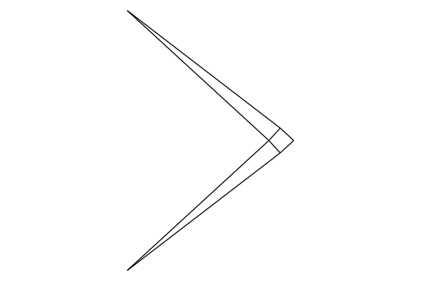

# 1.575J/4.450J/4.451 Homework 02 // Michell Truss
This problem asks you to consider the classical Michell truss in a parameterized, numerical context. Based on Lecture 02 and Lecture 03 slides, Lab 01 slides, and the Mazurek et al. 2011 reading, you will implement a method for generating, analyzing, and optimizing cantilever truss structures subject to a point load at the tip.

This repository acts as a starting point for those interested in using Julia to tackle this homework problem. A set of useful functions are predefined for you that are analogous to components you would likely use if you were tackling this problem in Grasshopper.

# How to set yourself up
## Install Julia
Download and install [Julia](https://julialang.org/). If you are on a Windows PC, make sure you add Julia to your PATH environment variables (there should be a check option during installation).

## Install Visual Studio Code
Download and install [Visual Studio Code](https://code.visualstudio.com/).

## Install the Julia language extension
On the "Extensions" section of your sidebar, find the julia extension and install it.
