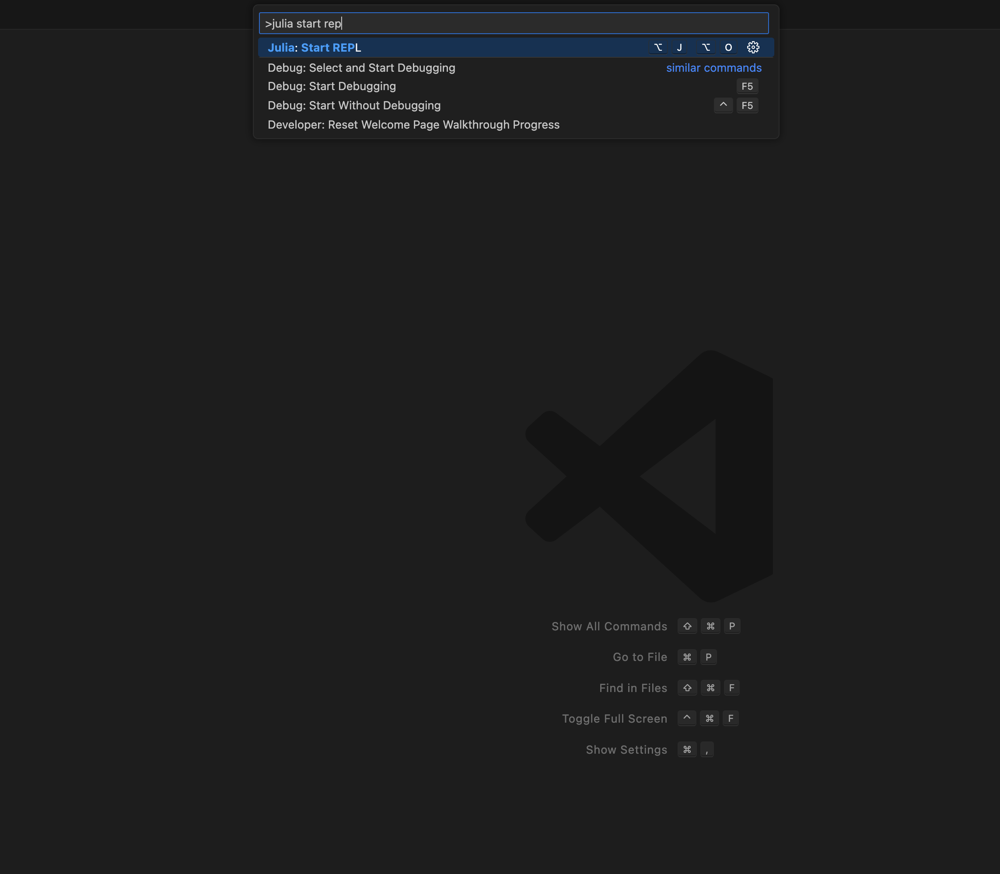
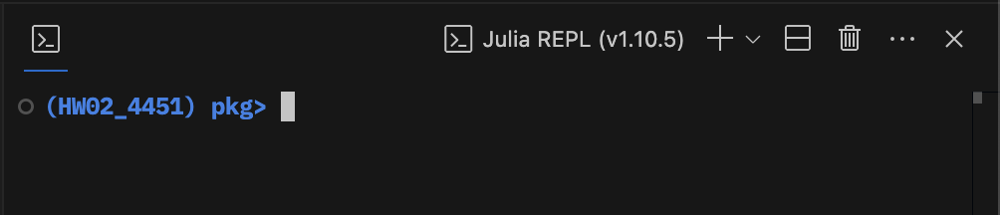

# 1.575J/4.450J/4.451 Homework 02 // Michell Truss
This problem asks you to consider the classical Michell truss in a parameterized, numerical context. Based on Lecture 02 and Lecture 03 slides, Lab 01 slides, and the Mazurek et al. 2011 reading, you will implement a method for generating, analyzing, and optimizing cantilever truss structures subject to a point load at the tip.

This repository acts as a starting point for those interested in using Julia to tackle this homework problem. A set of useful functions are predefined for you that are analogous to components you would likely use if you were tackling this problem in Grasshopper.

# How to set yourself up
## Install Julia
Download and install [Julia](https://julialang.org/). If you are on a Windows PC, make sure you add Julia to your PATH environment variables (there should be a check option during installation).

## Install Visual Studio Code
Download and install [Visual Studio Code](https://code.visualstudio.com/).

## Install the Julia language extension
On the "Extensions" section of your sidebar, find the julia extension and install it.

## Clone/download this repository
Either clone this repository using git, or simply download all the contents as a .zip file

Extract the contents of the .zip file to somewhere on your computer.

## Open the folder in VS Code

## Start Julia
Press `ctrl+shift+p` (Windows) or `cmd+shift+p` (Mac) and type: `Julia start REPL` and hit enter. 

You've now started a Julia session, which should look something like this:

## Check your environment
Press `]` in the Julia REPL (the Julia instance in the terminal) to enter package mode.

If it looks like this:  

Continue to the next step. You are in the `HW02_4451` environment, which will take care of all of your package dependencies.

If it looks like this:  

You are in the general Julia environment. Type `activate .` to enter the environment set up for this homework:  

## Install dependencies
You will only have to do this once. Type `instantiate` and press enter to install all the packages that you will need for this homework.  

## Return to normal Julia mode
Hit the backspace in the Julia REPL to exit package mode.

## Running a script
Open `function_overview.jl`  

Click anywhere on the first line and press `shift+enter`. This will run what is written in that line (or block of code) and will move the focus onto the next line/block of code. This fill explains the predefined data structures and functions that may be useful when working on this homework.

Try running `truss_example.jl`

# For your homework
The rest of this is up to you! I've made a `problem1.jl` file for you start playing around.
You can define new functions here and use them later, or you can take a look at how `src/` is structured to make your own functions that are part of the overall `HW02_4451` package environment, and export it so you can keep your code a bit more organized!